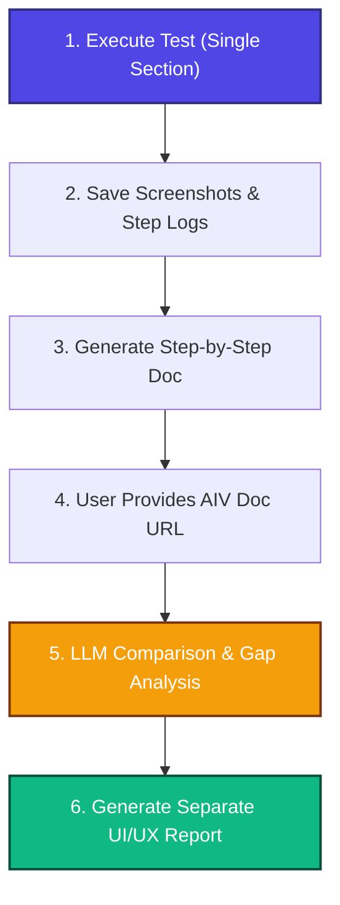

# AIV Automation, Documentation & UI/UX Analysis Strategy

This document outlines the execution model and strategy for AIV automation. It focuses on section-by-section test execution, automatic documentation compilation, comparison with official docs, and generating a separate report for UI/UX improvements.

---

## 1. Execution Workflow (Section-by-Section)

Instead of running the entire regression suite at once, the strategy is to automate and analyze **one section at a time** (e.g., *Reports*, *Merge Reports*, *Master Data*, etc.) using the following four-step lifecycle:

---

## 2. Step-by-Step Implementation Details

### Phase 1: Run & Capture (Playwright)
* **Action**: Run the specific test file (e.g., `npm run daily:reports`).
* **Capture**:
  * Take a screenshot during every critical user action (e.g., clicking the Reports menu, opening the Scheduler modal, selecting frequency, entering To/CC fields).
  * Save screenshots to `screenshots/<section-name>/` (e.g., `screenshots/reports/step-1.png`, `screenshots/reports/step-2.png`).
  * Generate a step log JSON showing the actions performed.

### Phase 2: Prepare Step Documentation (LLM)
* **Input**: The step log JSON and screenshots.
* **Output**: A new markdown file `docs/generated/<section-name>.md` detailing exactly how the section works, step-by-step, matching the live application behavior.

### Phase 3: URL Comparison & Gap Analysis
* **Trigger**: The user provides the URL to the existing AIV documentation (e.g., `https://v6.docs.aivhub.com/Reports`).
* **Action**:
  1. Fetch the official documentation content from the URL.
  2. Strip HTML wrappers and convert the page content to Markdown.
  3. Compare the **official documentation** against the **newly generated step documentation**.
* **Output (`docs/analysis/<section-name>-doc-gap.md`)**:
  * **Missing Steps/Buttons**: Features verified in the app but missing in the official documentation.
  * **Outdated Actions**: Outdated steps in the official docs that no longer match the current UI flow.
  * **Inaccuracies**: Incorrect field names, button labels, or tab positions.

### Phase 4: UI/UX & Feasibility Suggestions (Separate File)
* **Input**: Screenshots and action flows.
* **Output (`docs/analysis/<section-name>-ui-ux-feedback.md`)**:
  * A dedicated file suggesting improvements to make AIV more user-friendly.
  * Focuses on element discoverability, click-depth reduction, visual layout refinement, accessibility, and ease of use.

---

## 3. Benefits of this Approach
1. **Incremental & High-Quality**: We focus 100% of our attention on one section at a time, ensuring complete correctness before moving to the next.
2. **Context & Token Savings**: By manually specifying the documentation URL and processing one section at a time, we minimize LLM token usage and prevent context overload.
3. **Structured Outputs**: Separating the *Documentation Gaps* from *UI/UX Suggestions* keeps the reports organized, clean, and directly actionable.
